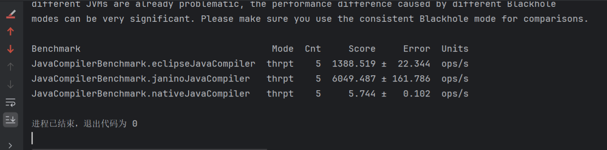
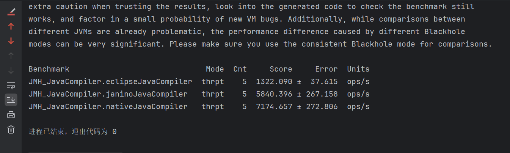

## JavaCompiler API 的内存编译优化用例
### 用法
```java
String lambdaSource = """
        import java.util.function.BiFunction;
        public class LambdaContainer {
            public static BiFunction<Integer, Integer, Integer> getLambda() {
                return (x, y) -> x + y;
            }
        }
        """;

CompilationResult compile = JavaCompiler.NATIVE.compile("LambdaContainer.java", lambdaSource);
```

### 优化之前



### 优化之后



### 优化思路
### [JavaCompiler API 为什么这么慢？如何将动态编译的速度优化一千倍](https://juejin.cn/post/7364409181053321242)

### License

This project is licensed under the `GPLv2 with the classpath exception`. See the [LICENSE](LICENSE) file for details.